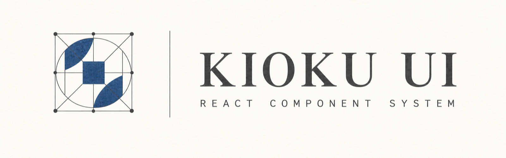

<picture>
  <source media="(prefers-color-scheme: dark)" srcset="assets/brand/hero-dark.png" />
  <source media="(prefers-color-scheme: light)" srcset="assets/brand/hero-light.png" />
  
</picture>

<div align="center">

**Product-neutral primitives**

React 19 components, semantic tokens, and themes.

<br />

[Component API](packages/core/README.md) · [Design Language](docs/design-language.md) · [Report Issue](https://github.com/Misoto22/kioku-ui/issues)

<br />


</div>

---

Kioku UI provides components, tokens, themes, and StyleX build integrations. It
does not provide application routes, APIs, data access, or business logic.

---

### Features

- **Composable components** — primitives, controls, form inputs, overlays, navigation, data display, and chat interfaces share one token contract.
- **Host-owned themes** (`ThemeProvider`) — validate and supply the theme list, default theme, and optional persistence from the application that owns them.
- **Four Kioku themes** (`kiokuThemes`) — use Washi, Muji, Sumi, or Kasumi as a ready-made theme pack.
- **Two consumption modes** — import compiled CSS with no StyleX setup, or author from source with the Vite, Babel, or PostCSS integrations.
- **Router-neutral navigation** (`LinkProvider`) — adapt links to the host router without adding a routing dependency.
- **Accessibility audit** (`pnpm a11y:audit`) — builds Storybook and audits its stories with Playwright and axe-core.

---

### Packages

| Package                                                             | Use                                                        |
| ------------------------------------------------------------------- | ---------------------------------------------------------- |
| [`@misoto22/kioku-ui`](packages/core/README.md)                     | React components, token contracts, CSS, and source entries |
| [`@misoto22/kioku-ui-theme-kioku`](packages/themes/kioku/README.md) | Washi, Muji, Sumi, and Kasumi theme definitions and CSS    |
| [`@misoto22/kioku-ui-build`](packages/build/README.md)              | Vite, Babel, and PostCSS setup for source authoring        |

---

### Tech Stack

<table>
<tr><td><b>Runtime</b></td><td>React 19 · <code>@stylexjs/stylex</code> 0.19.0</td></tr>
<tr><td><b>Language</b></td><td>TypeScript 6</td></tr>
<tr><td><b>Workspace</b></td><td>pnpm 11.10.0 · Node.js 24+</td></tr>
<tr><td><b>Quality</b></td><td>ESLint · Vitest · Playwright · axe-core</td></tr>
<tr><td><b>Documentation</b></td><td>Storybook 10 · Vite 8</td></tr>
<tr><td><b>Release</b></td><td>Changesets · npm trusted publishing with OIDC provenance</td></tr>
</table>

---

### Project Structure

```
packages/
├── core/                   Components, token contracts, themes, and navigation adapters
├── themes/kioku/           Washi, Muji, Sumi, and Kasumi theme pack
└── build/                  Vite, Babel, and PostCSS integrations for source consumers

apps/
├── docsite/                Vite documentation site
├── storybook/              Component catalogue and accessibility-audit target
├── sandbox/                Workspace playground
└── example-*/              Standalone Vite and Next.js package-consumer checks

internal/
├── scripts/                Workspace, package-boundary, export, and pack-smoke gates
├── stylex-capabilities/    Supported StyleX behaviour probes
└── vibe-tests/             Visual and interaction assertions

docs/
├── adr/                    Architecture decisions
├── operations/             Release runbook
└── design-language.md      System-wide visual and implementation rules
```

---

### Getting Started

```sh
pnpm add @misoto22/kioku-ui @misoto22/kioku-ui-theme-kioku
```

**Prerequisites** — React 19 and pnpm. Node.js 24+ is required to develop this repository and use `@misoto22/kioku-ui-build`.

```tsx
import {Button, ThemeProvider} from '@misoto22/kioku-ui';
import '@misoto22/kioku-ui/reset.css';
import '@misoto22/kioku-ui/styles.css';
import {kiokuThemes} from '@misoto22/kioku-ui-theme-kioku';
import '@misoto22/kioku-ui-theme-kioku/theme.css';

export function App() {
  return (
    <ThemeProvider defaultThemeId="washi" themes={kiokuThemes}>
      <Button>Save</Button>
    </ThemeProvider>
  );
}
```

Compiled consumers need no StyleX configuration.

<details>
<summary>Author against the source entry</summary>

Source consumers install `@misoto22/kioku-ui-build`, import
`@misoto22/kioku-ui/source` and `@misoto22/kioku-ui/authoring.stylex`, and do
not import `styles.css`. Choose the integration that matches the host:
[Vite, Babel, and PostCSS setup](packages/build/README.md).

</details>

<details>
<summary>Develop Kioku UI locally</summary>

```sh
git clone https://github.com/Misoto22/kioku-ui.git
cd kioku-ui
pnpm install
pnpm check
```

```
pnpm check              Run repository gates, lint, builds, type checks, and tests
pnpm storybook          Start the component catalogue on port 6006
pnpm docsite            Start the Vite documentation site
pnpm a11y:audit         Audit Storybook with Playwright and axe-core
pnpm pack:smoke         Pack and install published-package tarballs in a fresh workspace
pnpm release:verify     Run the release workflow's verification commands
```

The four `example-*` apps intentionally sit outside the pnpm workspace. Each
uses its own install, so CI exercises the packages as consumers do.

</details>

---

### Documentation

| Document                                                                      | Covers                                                          |
| ----------------------------------------------------------------------------- | --------------------------------------------------------------- |
| [Component API](packages/core/README.md)                                      | Components, token contracts, themes, and both consumption modes |
| [Build integrations](packages/build/README.md)                                | StyleX configuration for Vite, Babel, and PostCSS               |
| [Design language](docs/design-language.md)                                    | The visual and implementation rules behind every component      |
| [Architecture decision](docs/adr/0001-astryx-aligned-product-architecture.md) | Public-package boundaries and Astryx-aligned repository shape   |
| [Release runbook](docs/operations/release.md)                                 | Changesets, release authority, trusted publishing, and recovery |

---

### Boundaries

The host application owns its router, theme selection, persistence, data, and
domain behaviour. Kioku UI owns only reusable interface primitives and their
contracts. `pnpm check:package-boundaries` enforces that core source does not
import host application paths, name a specific theme skin, choose a default
theme, or reach for browser storage.

---

### Release

Every user-visible public-package change needs a Changeset. Merging to `main`
updates the Changesets release pull request; merging that approved pull request
publishes through the protected npm environment. See the [release
runbook](docs/operations/release.md) for the required GitHub and npm controls.

---

<div align="center">
<sub>Built by <a href="https://github.com/Misoto22">Misoto22</a> · MIT</sub>
</div>
