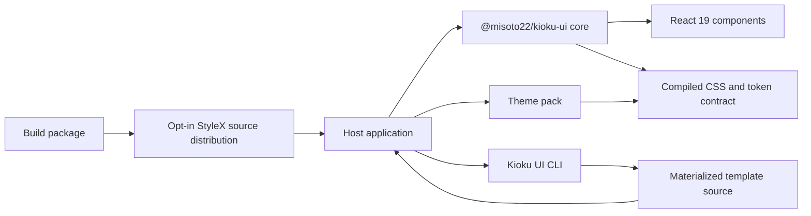

# Astryx-Aligned Kioku UI Design

**Status:** Approved design, pending spec review

**Goal:** Build `Misoto22/kioku-ui` into a public, agent-ready React design-system product that fully mirrors Astryx's architectural and delivery model, then migrate Kioku Console to use its generic UI layers.

**Reference:** [facebook/astryx](https://github.com/facebook/astryx) at its current `main` branch. “Alignment” means the same product shape, consumer workflow, package categories, quality gates, and contributor experience. It does not mean copying Astryx source code, claiming API compatibility, or importing Kioku personal-data concepts into the library.

## Decisions

- The GitHub repository is public: `Misoto22/kioku-ui`.
- The public npm namespace is `@misoto22`. The primary package is `@misoto22/kioku-ui`.
- React 19 is the supported component runtime. CSS tokens remain usable outside React.
- All authored component styles use StyleX. Consumers receive a compiled CSS/JavaScript distribution and may instead opt into source distribution with a build integration.
- The repository uses pnpm workspaces, Changesets, semantic versioning, and npm trusted publishing.
- Templates follow Astryx's CLI-owned source workflow. `kioku-ui template <name>` materializes source into the host application; templates are not maintained as imported black-box pages.
- Components, patterns, templates, themes, CLI commands, docs, and agent guidance have typed, discoverable metadata.
- A theme is a token-contract implementation, never an enum or palette hidden in core. The first theme pack contains the existing Kioku Washi, Muji, and Sumi themes.
- Core packages contain no Kioku API client, router import, source registry, business copy, translated copy, or personal-data type.
- Generic charts are deliberately deferred until the second phase. Existing Kioku chart implementations remain in Kioku until a chart primitive passes the same system contract.
- The repository uses the MIT license, matching the approved Astryx-aligned public-library model.

## Target repository structure

```text
kioku-ui/
├── .changeset/
├── .github/
│   └── workflows/
├── apps/
│   ├── docsite/
│   ├── example-nextjs/
│   ├── example-nextjs-source/
│   ├── example-vite/
│   ├── example-vite-source/
│   ├── sandbox/
│   ├── storybook/
│   └── template-viewer/
├── docs/
│   ├── adr/
│   └── superpowers/
│       ├── plans/
│       └── specs/
├── internal/
│   ├── eslint-plugin-kioku-ui/
│   ├── scripts/
│   ├── stylex-capabilities/
│   ├── test-utils/
│   └── vibe-tests/
├── packages/
│   ├── build/                         # @misoto22/kioku-ui-build
│   ├── charts/                        # @misoto22/kioku-ui-charts, phase 2
│   ├── cli/                           # @misoto22/kioku-ui-cli
│   ├── core/                          # @misoto22/kioku-ui
│   ├── lab/                           # experimental; unpublished
│   ├── themes/
│   │   └── kioku/                     # @misoto22/kioku-ui-theme-kioku
│   └── vega/                          # @misoto22/kioku-ui-vega, phase 2
├── CONTEXT.md
├── LICENSE
├── package.json
└── pnpm-workspace.yaml
```

`apps/example-*` are copyable consumer applications rather than workspace-linked products. The remaining `apps`, published packages, and internal tools participate in the workspace. The tree is intentionally the same kind of boundary as Astryx's `apps/`, `packages/`, and `internal/` separation.

## Public package model

| Directory | Package | Responsibility |
| --- | --- | --- |
| `packages/core` | `@misoto22/kioku-ui` | Components, themes runtime, token-facing utilities, accessibility helpers, authored source, and precompiled consumer CSS. |
| `packages/cli` | `@misoto22/kioku-ui-cli` | Discoverable component documentation, template source materialization, theme scaffolding, integration discovery, swizzling, codemods, and diagnostics. |
| `packages/build` | `@misoto22/kioku-ui-build` | Babel, PostCSS, and Vite integration for opt-in StyleX source distribution. |
| `packages/themes/kioku` | `@misoto22/kioku-ui-theme-kioku` | The Kioku Washi, Muji, and Sumi token-contract implementations. |
| `packages/lab` | unpublished | Experimental components evaluated before promotion to core. |
| `packages/charts` | `@misoto22/kioku-ui-charts` | Themeable chart components after the phase-two primitive contract is established. |
| `packages/vega` | `@misoto22/kioku-ui-vega` | Vega/Vega-Lite bridge used by the chart package after phase two. |

The primary install remains concise:

```sh
pnpm add @misoto22/kioku-ui @misoto22/kioku-ui-theme-kioku
pnpm add -D @misoto22/kioku-ui-cli
```

Themes, charts, and the build tool are independently versioned packages because a consumer should not pay their runtime or build cost merely to render a Button.

## Runtime and consumer contracts



Core exposes only presentational or headless UI contracts. A host application supplies all domain data, translation, fetching, error classification, navigation destinations, and mutation behavior. `LinkProvider` or an equivalent injected adapter keeps navigation components compatible with React Router, Next.js, and ordinary anchors without importing one router into core.

`ThemeProvider` accepts registered theme metadata, selected theme, color mode, density, and an optional persistence adapter. The provider never contains the identifiers `washi`, `muji`, `sumi`, a Kioku storage key, or a hard-coded default. Components consume semantic token roles only. Raw values belong in a theme definition; components never introduce new literal palette values.

## Component, pattern, and template scope

The initial core release must cover the repeated UI already present in Kioku Console before any product page is migrated.

| Family | Initial public surface |
| --- | --- |
| Foundations | `Text`, `Heading`, `Stack`, `Inline`, `Grid`, `Center`, `Section`, `Divider`, `VisuallyHidden`, semantic color and type tokens. |
| Containers and layout | `Card`, `CardHeader`, `CardFooter`, `Layout`, `LayoutHeader`, `LayoutContent`, `LayoutPanel`, `AppShell`. |
| Actions and navigation | `Button`, `IconButton`, `Link`, `Badge`, `StatusDot`, `Tabs`, `Disclosure`, `SideNav`, `MobileNav`, injected link support. |
| Forms | `Field`, `FieldLabel`, `FieldStatus`, `TextInput`, `TextArea`, `Toggle`, `SegmentedControl`, `Select`, `ActionBar`. |
| Data and feedback | `Table`, `DataTable`, `MetricGrid`, `DefinitionList`, `EmptyState`, `Spinner`, `Skeleton`, `Alert`, `AsyncState`. |
| Authoring | `CodeBlock`, `MarkdownEditor`, `InlineEdit`, each isolated from product-specific data and labels. |

The CLI catalog ultimately covers the same component-family breadth as Astryx: layout, navigation, input, selection, overlay, feedback, data display, media, internationalization, and AI interaction. Each promoted component requires an exported public API, documentation metadata, usage examples, a Storybook story, keyboard and screen-reader tests, dark-theme coverage, and a template or explicit rationale for not needing one.

Templates are source-owned by their consumer. The initial Kioku-derived template catalog contains dashboard, table page, settings, review/approval, and split editor/preview structures. As alignment progresses, the catalog grows through the same page/block separation used by Astryx. A template may compose only documented public components and host-provided content; it never imports Kioku API hooks or Console screen modules.

## Documentation and agent workflow

`apps/docsite` is the authoritative public documentation site. It presents foundations, component APIs, patterns, templates, themes, build integrations, migration guides, changelog, and CLI references. `apps/storybook` provides visual development and regression fixtures; `apps/sandbox` is the local environment for testing source distribution, theme permutations, and experimental interactions; `apps/template-viewer` displays materialized-template outcomes.

The CLI mirrors the docs in terminal and JSON form. The first command family is `init`, `component`, `template`, `theme`, `search`, `docs`, `swizzle`, `upgrade`, and `doctor`. `init` writes the generated component index and usage rules into `AGENTS.md` or `CLAUDE.md`, so human contributors and agents use the same component catalog instead of inventing local variants. Integration manifests allow external packages to contribute components, templates, themes, and codemods through this one discovery surface.

## Quality, release, and security model

Every production behavior is developed test-first. Core unit and integration tests use Vitest and React Testing Library. Storybook provides interaction and visual fixtures. Playwright plus axe verifies accessibility; the CI policy fails on new accessibility regressions. RTL auditing, responsive visual regression, export validation, package-boundary checks, generated-artifact synchronization, and agent/vibe tests are first-class repository gates.

Published packages use Changesets and semantic versioning. Canary releases are distinct from stable releases. GitHub Actions uses npm trusted publishing rather than a long-lived repository token. CI must verify package tarball contents, public export maps, generated docs, example applications, source-distribution builds, and compiled-distribution builds before publication. No fixtures, documentation, demos, or package tests may contain Kioku owner data, API tokens, or private service URLs.

## Kioku Console migration boundary

Kioku remains the host application. It retains the API client, API types, persistence, authentication, router composition, translations, content, astrology logic, flow editor logic, and domain charts until phase two establishes generic chart contracts.

The first migration removes duplicate Console foundations: `tokens.css`, base visual rules, appearance-provider behavior, router-coupled page heading, generic table mechanics, repeated card/section layout, generic form controls, empty/error/loading states, and navigation mechanics. Kioku wraps these with its own route links, translation strings, view models, and storage policy. Product-aware components such as source marks, credential fields, approval semantics, and personal media shelves remain in Kioku until they can be expressed as neutral components with host-supplied labels and behavior.

Kioku verifies each migration against a packed prerelease of the public packages, not an accidental filesystem import. This protects the actual npm exports and catches missing CSS, peer dependency, and build configuration before a release claims external reuse.

## Phased execution

### Phase 0 — repository and contributor baseline

Create the public repository, pnpm workspace, license, Changesets, root scripts, formatting/linting, CI skeleton, `CONTEXT.md`, ADRs, and this specification. Establish package-boundary validation and a minimal shared test utility before adding component source.

**Exit criteria:** a clean checkout installs reproducibly; root checks run; the repository has documented public-package ownership and no Kioku domain code.

### Phase 1 — core foundations and theme contract

Implement StyleX authoring, compiled CSS export, build integration, semantic token definitions, `Theme`, `LinkProvider`, density and mode contracts, then the foundation/layout/action/form/feedback components needed by the Console extraction. Implement the Kioku theme pack as independently registered Washi, Muji, and Sumi themes.

**Exit criteria:** each component has red-green tests, docs metadata, a Storybook story, a11y coverage, dark-mode coverage, and package-tarball verification; a Vite and a Next.js example consume the compiled package.

### Phase 2 — Console patterns and first adoption

Implement router-neutral application shell, sidebar/mobile navigation, table and async-state patterns, page heading, metric layouts, and authoring patterns. Replace the corresponding generic layers in Kioku Console while retaining its router adapters, translations, data hooks, and product semantics.

**Exit criteria:** Kioku consumes versioned package artifacts for each migrated primitive; its generic duplicate styles are removed only after browser and automated regression evidence confirms equivalent desktop, narrow-screen, keyboard, and dark-theme behavior.

### Phase 3 — CLI, source templates, and integration protocol

Implement typed component/template/theme documentation, JSON output, discovery, template source materialization, theme scaffolding, `init`, `doctor`, swizzling, versioned codemods, and external integration manifests. Publish dashboard, table, settings, review/approval, and editor/preview templates through the CLI.

**Exit criteria:** a fresh external Vite project can install the published packages, run `init`, inspect a component in JSON, materialize a template, build it, and pass `doctor` without access to this repository.

### Phase 4 — public documentation and reference applications

Build docsite component, token, theme, template, CLI, migration, and changelog pages; complete Storybook, sandbox, template viewer, and standalone Next.js/Vite reference applications for compiled and source distributions.

**Exit criteria:** every stable exported component, theme, CLI command, and template has one authoritative doc entry, runnable example, and tested import path.

### Phase 5 — chart platform

Define chart data, theming, accessibility, and peer-engine contracts. Implement the Vega bridge and themeable chart package under canary tags, then migrate only Kioku charts that satisfy that contract.

**Exit criteria:** charts have non-color-only encodings, text alternatives, keyboard/tooltip behavior where applicable, theme coverage, and canary consumer verification. Kioku-specific visualizations remain local when they fail the generic contract.

### Phase 6 — full Astryx-grade quality and release operation

Add automated visual regression, RTL audit, source/compiled distribution matrix, complete a11y baseline policy, generated-doc consistency checks, agent/vibe tests, release canaries, trusted publishing, changelog automation, and contributor templates. Continue expanding the component/template catalog until all target Astryx families have a Kioku UI equivalent or an explicitly documented replacement.

**Exit criteria:** stable package releases are reproducible from `main`, consumers can discover every public capability through web docs or CLI, and CI proves the same accessibility, distribution, documentation, and package-boundary guarantees for every release.

## Non-goals

- No personal-data model, backend API client, Kioku authentication flow, service URL, credential, or domain schema enters the public library.
- No claim is made that `@misoto22/kioku-ui` can substitute for `@astryxdesign/core` or preserve Astryx API names.
- No generic chart package is introduced before the chart accessibility and data contracts are explicitly defined.
- No host application is required to use React Router, a particular translation system, a particular state library, or a particular persistence strategy.
